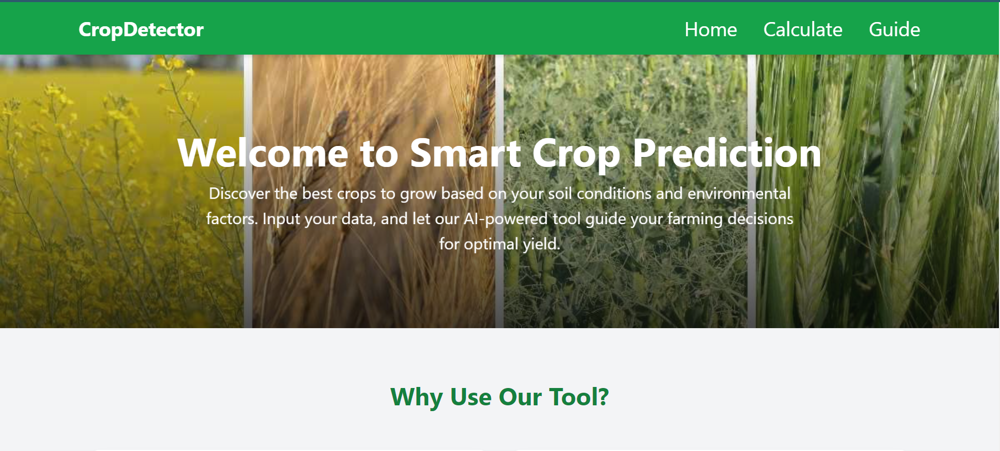
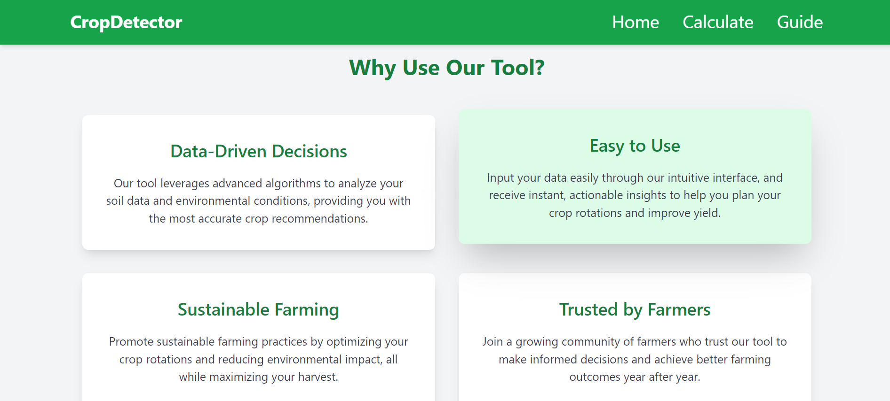
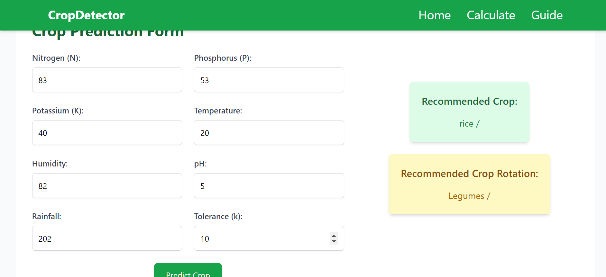
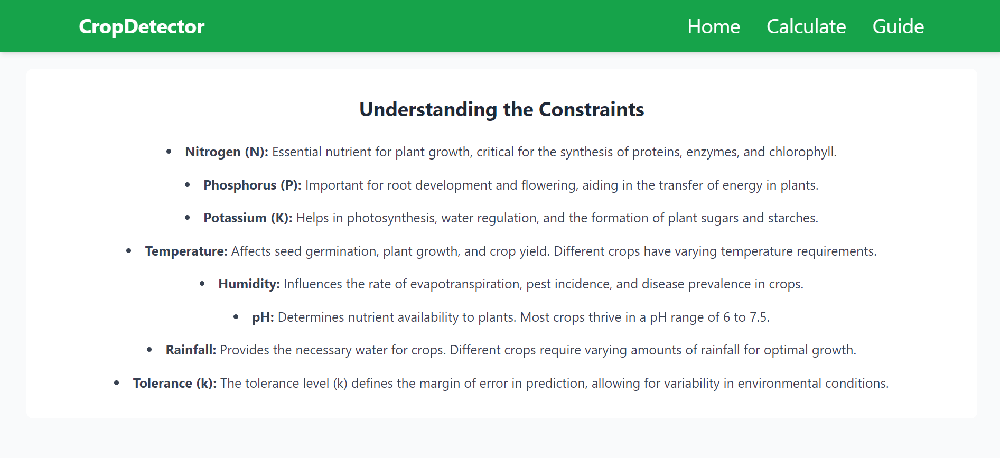
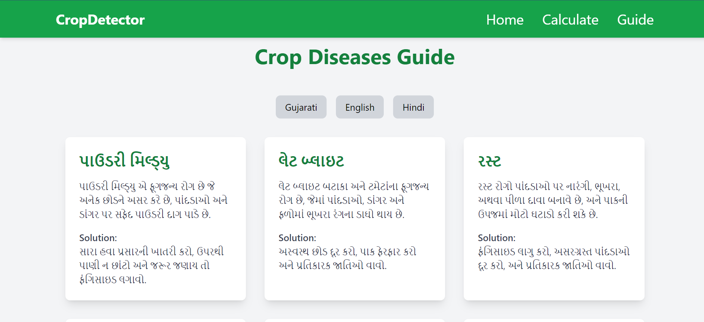

# Crop Recommendation System ☘️

Welcome to the Crop Recommendation System! This project aims to help farmers select the best crop based on environmental conditions and soil nutrients using machine learning algorithms.

## Project Overview

The objective of this project is to develop an AI-driven system that recommends suitable crops based on seven key input factors:
- Nitrogen (N)
- Phosphorus (P)
- Potassium (K)
- pH level
- Rainfall
- Temperature
- Humidity

# Web View

## Home Page
<p align="center">
  
  
</p>

## calculate
<p align="center">
  
  
</p>

## Framer Guid
<p align="center">
  
</p>

## Repository Structure

This repository is organized into multiple branches to facilitate parallel development:
- **main**: The stable branch containing the integrated code.
- **Crop_Recommendation**: The branch for the backend AI model development (crop detection).
- **frontend_form**: The branch for the frontend development (React-based UI).

## Branch Details

### Crop_Recommendation - Crop Detection

This branch contains the code for the AI model responsible for detecting the best crop based on input factors. 

**Key Components:**
- **Dataset:** The dataset includes columns for N (Nitrogen), P (Phosphorus), K (Potassium), temperature, humidity, pH, rainfall, and label (crop type).
- **Model:** The model uses a distance-based or range-based filtering algorithm to process the inputs and output the recommended crop type as a string.

**Usage:**
- Train the model with the provided dataset.
- Predict the best crop based on input values using a distance-based or tolerance-based algorithm.

### frontend_form - Frontend Development

This branch features the frontend UI developed using React. It allows users to input the environmental and soil data and view the recommended crop.

**Key Components:**
- **Inputs:** Users can input values for nitrogen, phosphorus, potassium, pH, rainfall, temperature, and humidity.
- **Output:** The recommended crop type is displayed based on the prediction made by the backend model.

**Usage:**
- Integrate with the backend API to fetch predictions.
- Display the recommended crop in the user interface.

## Getting Started

1. **Clone the Repository:**

   ```bash
   git clone https://github.com/yash-sojitra-20/Crop-Recommendation-System.git
   ```

2. **Navigate to the Project Directory:**

   ```bash
   cd Crop-Recommendation-System
   ```

3. **Checkout the Branch You Want to Work On:**

   ```bash
   git checkout Crop_Recommendation  # For backend
   git checkout frontend_form  # For frontend
   ```

4. **Install Dependencies:**

   For backend (Python):
   ```bash
   pip install -r requirements.txt
   ```

   For frontend (React):
   ```bash
   npm install
   ```

5. **Run the Project:**

   Backend:
   ```bash
   python -m uvicorn main:app --reload
   ```

   Frontend:
   ```bash
   npm start
   ```

## Contributing

Feel free to contribute to this project by creating new branches, submitting pull requests, and reporting issues.
